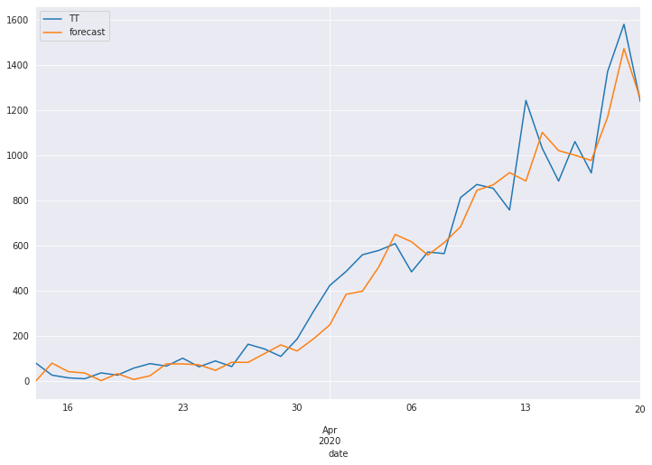
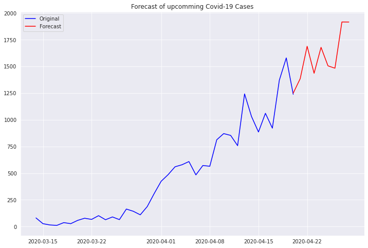

# Time-Series-Forecasting-for-Covid-19
Forecasting Covid-19 Cases in India

### Aim
  To build a model that can predict the values of upcomming Covid-19 cases provided the timeseries of 
  already confirmed datewise cases in India.
  The approach used in this project can be exteded to statewise data to get statewise predictions.
      
### Methodology
  1. Gathering data from API ( 'https://api.covid19india.org/csv/latest/state_wise_daily.csv' ) and preprocessing.
  2. Analysing if current time series is stationary or not using **Augmented Dickey-Fuller unit root test.**
  3. Converting the series into stationary using **differencing** method.
  4. Analysing ACF and PACF and tuinning values of **p,d,q.**
  5. Using our model to predict the values of the current timeseries and comparing it with orignal data.
  6. Forecasting and plotting values for future.
  
  
### Results

 **Comparing predicted value to orignal values**

**Forecasting for upcomming week**

### References
  1. https://www.kaggle.com/sumi25/understand-arima-and-tune-p-d-q
  2. https://machinelearningmastery.com/time-series-forecasting-methods-in-python-cheat-sheet/
  3. Api for gathering data : https://api.covid19india.org/ 
